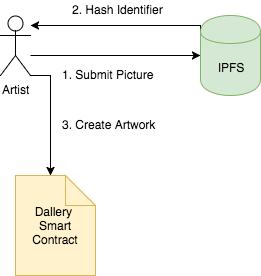
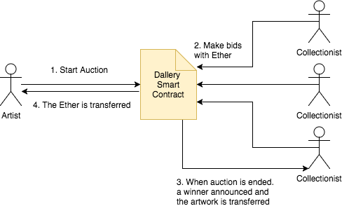

# Darticles

## Introduction

Darticles is a decentralized gallery and artwork auctioning platform built on Ethereum. People can manage their portfolios and have a cryptographic proof that the containing artwork is theirs. No central authority is required.

## Index

* Why?
* How?
* Portfolio
* Auctions
* About

## Why?

Digital art does not have a suitable environment right now. Artists upload their artwork to centralized platforms, so they aren't owners of what they do. We propose a decentralized platform where artist can submit their artwork, expose them in galleries and sell them with absolute freedom without having to trust in any central authority.

## How?

Within the Darticles platform, artists can manage their own portfolios. No central authority can ban what they submit or erase their artwork. Artwork can be selled or auctioned. When an artwork is selled, it is transferred from the artist's portfolio to the bidder's one.
The Darticles platform is built on Ethereum. No ERC20 token is used, just plain Ether,
Images are stored in IPFS (Inter-Planetary File System) making them immutable and permanent. The images hashes are stored within the Blockchain, reducing the contract storage size.

## Profile

Both the artists and art collectionists can maintain a profile in the platform, specifying their name, pseudonym, and profile image.

## Portfolio

Each artist has a portfolio stored in the contract. The portfolio has own artworks and aquired artworks from other artists. Images are stored in IPFS, drastically reducing contract storage size.

## Auctions

Auctions can be started by artists or collectionists that have artworks of their own. 

## Withdrawing model

After an auction has ended, the biggest bid is divided among the artwork creator, the artwork owner and the contract owner. The contract implements the withdraw pattern, avoiding common issues in ether direct transfers.
Whenever a bid is replaced for a bigger one, the bid sender is returned the bid value, allowing him/her to withdraw the value from the contract.

## About

* Fernando Martín Ortiz
* Hernan Luis Paez